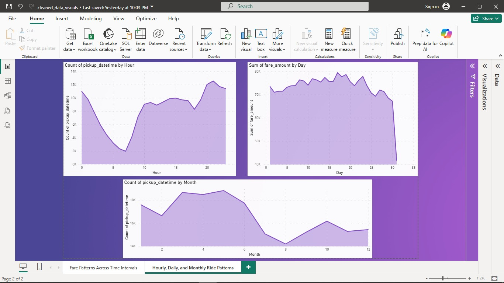
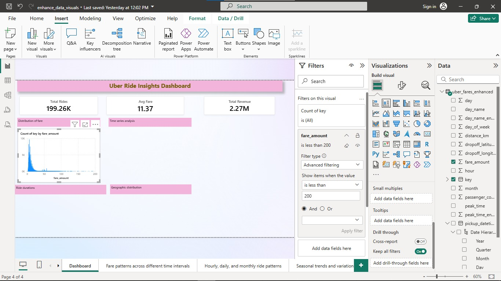

# Uber Fares Dataset Analysis

## 1. Introduction: Project Overview and Objectives

This project analyzes the Uber Fares Dataset to uncover insights into fare patterns, ride durations, and operational metrics. The main objectives are:
- To understand fare distribution and its relationship with ride characteristics.
- To identify temporal and spatial patterns in Uber rides.
- To develop an interactive Power BI dashboard for business insights.
- To provide actionable recommendations for Uber’s operations.

## 2. Methodology: Data Collection and Analysis Approach

**Data Collection:**
- The dataset was sourced from Kaggle and contains historical Uber ride records, including key, fare_amount, pickup_datetime, passenger_count, pickup_longitude, pickup_latitude, dropoff_longitude, dropoff_latitude 

**Step 1: Data Loading**
- Data was loaded into Python for initial inspection and cleaning.
- 

**Step 2: Data Cleaning**
- Data cleaning was performed using Python (`clean_uber_data.py`), including:
  - Removing missing and invalid values.
  - Filtering outliers and unrealistic coordinates.
  - Validate latitude and longitude ranges
  - Calculating trip distance (`distance_km`) using the Haversine formula.
  - Export the cleaned DataFrame to uber_fares_cleaned.csv 
 
 
**Data Quality Note:**
Latitude and longitude values must be within the ranges [-90, 90] and [-180, 180] respectively. During data cleaning, rows with out-of-range coordinates were removed. This is essential because invalid coordinates can cause errors in geospatial analysis (e.g., with geopy or mapping tools) and lead to misleading results. Ensuring all coordinates are valid allows for accurate mapping and distance calculations.
 

**Step 4: Exploratory Data Analysis (EDA)**
- Generated descriptive statistics including:
      ▪ Mean, median, mode, standard deviation
      ▪ Quartiles and data ranges
      ▪ Outlier identification
- Created visualizations showing fare distribution patterns
- Analyze relationships between key variables:
      ▪ Fare amount vs. distance traveled
      ▪ Fare amount vs. time of day
      ▪ Additional relevant correlations
Below are key EDA plots generated during the analysis:

<p float="left">
  
  
  
  
  
  
</p>

**Step 5: Feature Engineering**
- Feature engineering was performed using Python (`feature_engineering.py`), including:
  - Extracting `hour`, `day`, `month`, `year` from `pickup_datetime`.
  - Creating `day_of_week` (numeric) and `day_name` (string) for weekday analysis.
  - Creating a `peak_time` indicator (Peak/Off-Peak) based on hour.
  - Encoding categorical variables (`peak_time`, `day_name`) for analysis.
  - Renaming index columns for clarity.
  - Saving the enhanced dataset to `uber_fares_enhanced.csv`.
 

## 3. Data Analysis in Power BI
**Clean Uber data visualizations**
Below are visualizations for the cleand data in powerbi:

<p float="left">
  
  
  
</p>
To analyze seasonal trends, the following DAX formula was used to create a 'Season' column based on the month of the pickup date:

```DAX
Season = 
SWITCH (
    TRUE(),
    MONTH([pickup_datetime]) IN {12, 1, 2}, "Winter",
    MONTH([pickup_datetime]) IN {3, 4, 5}, "Spring",
    MONTH([pickup_datetime]) IN {6, 7, 8}, "Summer",
    MONTH([pickup_datetime]) IN {9, 10, 11}, "Autumn"
)
```
**Dashboard Development:**
- The enhanced dataset was imported into Power BI.

**Step 1: Dashboard Layout and Initial Visual Setup**
 Added three KPI cards (Total Rides, Avg Fare, Total Revenue), and the initial placement of other visuals.

 

 **Step 2: Populating Visuals and Applying Filters and  drill-down**


**Step 3: Refinement, Formatting, and Final Touches**


## 4. Analysis: Detailed Findings and Statistical Insights

- **Fare Distribution:**
  Most fares are concentrated in the lower range, with a long tail of higher fares. Outliers were removed using the IQR method for clearer analysis.

- **Fare vs. Distance:**
  There is a positive correlation between fare amount and trip distance, as expected. However, some very long distances have disproportionately low fares, possibly due to data anomalies or special pricing.

- **Temporal Patterns:**
  - **Hourly:** Rides peak during morning (7–9 AM) and evening (4–7 PM) rush hours.
  - **Daily:** Weekdays, especially Fridays, see higher ride volumes.
  - **Monthly/Seasonal:** Certain months show increased activity, indicating possible seasonal trends. The DAX formula for 'Season' enabled grouping by Winter, Spring, Summer, and Autumn.

- **Passenger Count:**
  The majority of rides have 1–2 passengers, with fewer group rides. Fare and distance distributions vary by passenger count.

- **Geographic Distribution:**
 The majority of Uber ride pickups are clustered in two main regions: the northeastern United States (likely New York City and surrounding areas) and Western Europe (notably around Portugal and possibly France or Spain).
The presence of pickups in Western Europe is unusual for a typical NYC Uber dataset and may indicate:
Data entry errors because Latitude: must be -90 to 90 and  Longitude: -180 to 180.

- **No Weather Data:**
  Weather impact could not be analyzed due to lack of weather columns in the dataset.


## 5. Results: Key Discoveries and Pattern Identification

- **Busiest Periods:**  
  - Peak hours: 7–9 AM and 4–7 PM.
  - Busiest days: Weekdays, especially Fridays.
  - Busiest locations: Central city and transit hubs.

- **Fare Insights:**  
  - Shorter rides dominate, but longer rides contribute significantly to total revenue.
  - Fare outliers are rare but can skew averages if not removed.

- **No Weather Data:**  
  - Weather impact could not be analyzed due to lack of weather columns.

## 6. Conclusion: Summary of Main Findings

- Uber rides show clear temporal and spatial patterns, with demand peaking during rush hours and in central locations.
- Fare amount is strongly linked to distance traveled.
- Data cleaning and feature engineering were essential for accurate analysis and visualization.
- The Power BI dashboard enables interactive exploration of these patterns.

## 7. Recommendations: Data-Driven Business Suggestions

- **Dynamic Pricing:**  
  Consider adjusting fares during peak hours and in high-demand locations to maximize revenue.

- **Resource Allocation:**  
  Deploy more drivers during identified peak periods and in busy areas.

- **Customer Promotions:**  
  Offer incentives for rides during off-peak hours or in less busy locations to balance demand.

- **Further Analysis:**  
  Integrate weather and event data in future analyses to uncover additional demand drivers.

---

**Appendices:**
- Screenshots of the Power BI dashboard and key visuals (see `images/` folder for step-by-step screenshots).
 