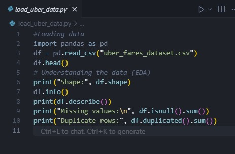

# Uber Fares Dataset Analysis

## 1. Introduction: Project Overview and Objectives

This project analyzes the Uber Fares Dataset to uncover insights into fare patterns, ride durations, and operational metrics. The main objectives are:
- To understand fare distribution and its relationship with ride characteristics.
- To identify temporal and spatial patterns in Uber rides.
- To develop an interactive Power BI dashboard for business insights.
- To provide actionable recommendations for Uber’s operations.

## 2. Methodology: Data Collection and Analysis Approach

**Data Collection:**
- The dataset was sourced from Kaggle and contains historical Uber ride records, including fare amount, pickup/dropoff coordinates, passenger count, and timestamps.

**Step 1: Data Loading**
- Data was loaded into Python for initial inspection and cleaning.
- 

**Step 2: Data Cleaning**
- Data cleaning was performed using Python (`clean_uber_data.py`), including:
  - Removing missing and invalid values.
  - Filtering outliers and unrealistic coordinates.
  - Calculating trip distance (`distance_km`) using the Haversine formula.
- 

**Feature Engineering:**
- Additional features were created (`feature_engineering.py`):
  - Extracted `hour`, `day`, `month`, `year`, `day_of_week`, and `day_name` from pickup timestamps.
  - Created a `peak_time` indicator (Peak/Off-Peak).
  - Encoded categorical variables for Power BI compatibility.

**Data Analysis:**
- Exploratory Data Analysis (EDA) was conducted in Python (`eda.py`), including:
  - Descriptive statistics (mean, median, mode, quartiles, etc.).
  - Outlier detection and removal.
  - Visualizations: fare distribution, fare vs. distance, time-based patterns, and correlation heatmaps.

**Dashboard Development:**
- The cleaned and enhanced dataset was imported into Power BI.
- Interactive visuals were created: fare distribution, time series, ride patterns by hour/day/month, and geographic maps.

## 3. Analysis: Detailed Findings and Statistical Insights

- **Fare Distribution:**  
  Most fares are concentrated in the lower range, with a long tail of higher fares. Outliers were removed using the IQR method for clearer analysis.

- **Fare vs. Distance:**  
  There is a positive correlation between fare amount and trip distance, as expected.

- **Temporal Patterns:**  
  - **Hourly:** Rides peak during morning (7–9 AM) and evening (4–7 PM) rush hours.
  - **Daily:** Weekdays, especially Friday, see higher ride volumes.
  - **Monthly/Seasonal:** Certain months show increased activity, indicating possible seasonal trends.

- **Geographic Distribution:**  
  Most rides originate from central city locations, with clusters around major transit hubs.

- **Passenger Count:**  
  The majority of rides have 1–2 passengers, with fewer group rides.

## 4. Results: Key Discoveries and Pattern Identification

- **Busiest Periods:**  
  - Peak hours: 7–9 AM and 4–7 PM.
  - Busiest days: Weekdays, especially Fridays.
  - Busiest locations: Central city and transit hubs.

- **Fare Insights:**  
  - Shorter rides dominate, but longer rides contribute significantly to total revenue.
  - Fare outliers are rare but can skew averages if not removed.

- **No Weather Data:**  
  - Weather impact could not be analyzed due to lack of weather columns.

## 5. Conclusion: Summary of Main Findings

- Uber rides show clear temporal and spatial patterns, with demand peaking during rush hours and in central locations.
- Fare amount is strongly linked to distance traveled.
- Data cleaning and feature engineering were essential for accurate analysis and visualization.
- The Power BI dashboard enables interactive exploration of these patterns.

## 6. Recommendations: Data-Driven Business Suggestions

- **Dynamic Pricing:**  
  Consider adjusting fares during peak hours and in high-demand locations to maximize revenue.

- **Resource Allocation:**  
  Deploy more drivers during identified peak periods and in busy areas.

- **Customer Promotions:**  
  Offer incentives for rides during off-peak hours or in less busy locations to balance demand.

- **Further Analysis:**  
  Integrate weather and event data in future analyses to uncover additional demand drivers.

---

**Appendices (Optional):**
- Screenshots of the Power BI dashboard and key visuals (see `images/` folder for step-by-step screenshots).
- Code snippets or links to your GitHub repository for reproducibility. 